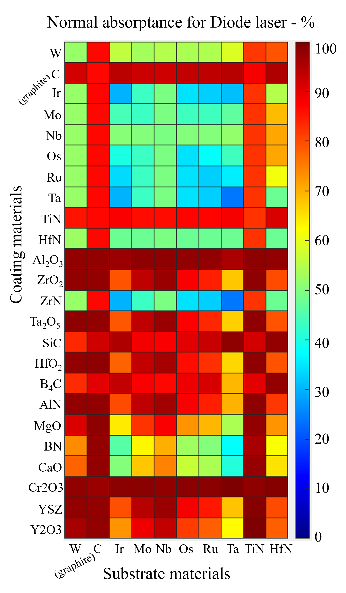

# Thin-Film TMM Optical Simulation

MATLAB-based Transfer Matrix Method (TMM) simulations for thin-film spectrally selective absorber/emitter structures.

## Applications

- Thermophotovoltaics (TPV)
- Thin-film optical coatings
- Spectral emissivity engineering
- Optical absorber/emitter design
- Multilayer photonic structures

## Features

- Spectral reflectance calculations
- Spectral emissivity calculations
- Thickness sweep analysis
- Material optical property integration
- MATLAB-based numerical modeling

## Example Result

## Project Structure

- `main.m` → Main simulation script
- `functions/` → TMM and optical calculation functions
- `data/` → Material optical property datasets
- `figures/` → Generated simulation plots
- `results/` → Exported numerical outputs

## Author

Nima Talebzadeh  
Photonics | TPV | Optical-Thermal Systems | Multiphysics Modeling
